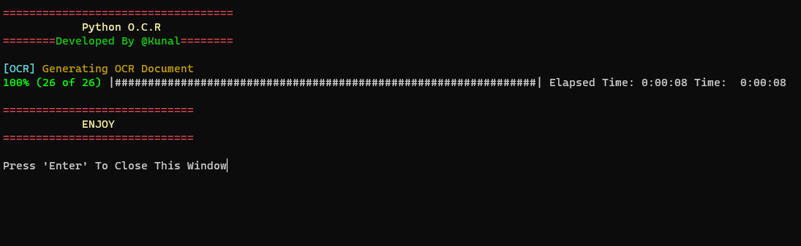

# Python OCR Program



## Overview
This Python program utilizes **Tesseract OCR** and **Pillow** to extract text from all images within a specified directory and generate a `.docx` file. The output document includes the images along with their respective extracted text.

## Features
- Processes all `.png` images in a specified directory.
- Extracts text using **Tesseract OCR**.
- Generates a **Word (.docx) file** containing:
  - Images from the directory.
  - Corresponding extracted text.
- Uses **progress bar** to show OCR progress.
- Customizable paths via environment variables.

## Prerequisites
Before running the script, ensure you have the following installed:
- **Python 3.11**
- **Tesseract OCR** ([Installation Guide](https://github.com/tesseract-ocr/tesseract))
- Required Python libraries (install via `pip`):
  ```bash
  pip install pillow pytesseract python-docx progressbar2 colorama python-dotenv
  ```

## Setup
1. **Install Tesseract OCR** and note its installation path.
2. **Configure Environment Variables**:
   - Create a `.env` file in the project directory and specify:
     ```ini
     TESERRACT_PATH=".\\Tesseract-OCR\\tesseract.exe"
     INPUT_IMAGE_DIR="D:\\input_images"
     OUTPUT_DIR="./result"
     ```
   - Replace paths accordingly.
3. **Ensure Input Directory Contains PNG Images**.

## Usage
1. **Run the script**:
   ```bash
   python main.py
   ```
2. The output file `ocr_result.docx` will be saved in the specified output directory.
3. Press **Enter** to exit when prompted.

## Example Output
- `ocr_result.docx` contains:
  - Extracted text from each image.
  - Images included alongside their recognized text.

## License
This project is licensed under the MIT License.

---
Developed by **@Kunal** 🚀

